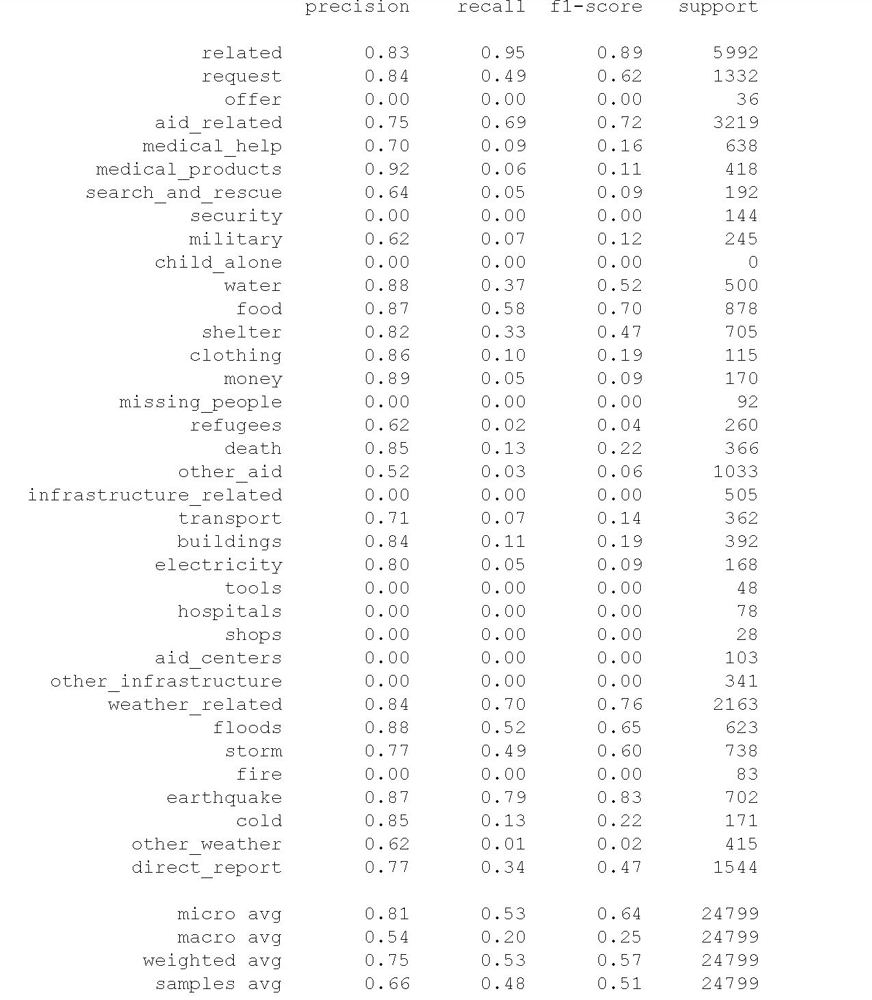

# disaster_responce_pipeline  
# installation  
you will need python, and a list of libraries:  
1- pandas  
2- numpy  
3- pickle  
4- sqlalchemy  
5- scikit-learn  
6- nltk

# Project Motivation  
this project aim to build a ETL pipeline and a ML pipeline to help disaster response organization  
in identifying important messages during first hours when organization are not prepared.  
  
# File Descriptions  
process_data.py- this is the ETL pipeline responsable for gathring data, cleaning data, and finally saving data to a database.  
train_classifier.py- this is the ML pipeline responsable for preparing data loaded from a database for ML, also it train, evaluate, and save the model.  

  
# How to Interact with your project  
process_data.py:  
provide the filepaths for messages.csv, categories.csv, database.db where data will be pulled from messages.csv and categories.csv then stored in database.db,  
(Example: python process_data.py disaster_messages.csv disaster_categories.csv DisasterResponse.db) please note that order is important.  

train_classifier.py:  
provide filepath to the database created from process_data.py and the name you want your model to be saved as with extension .pkl,  
(Example: python train_classifier.py DisasterResponse.db classifier.pkl) please note that order is important also training the model could take more than 1 hour.  

# results Summery  
by using only CountVectorizer, TfidfTransformer, and a RandomForestClassifier the folloeing results were achived:  

# acknowledgment  
i would like to thank figure-eight and udacity for providing the dataset.
